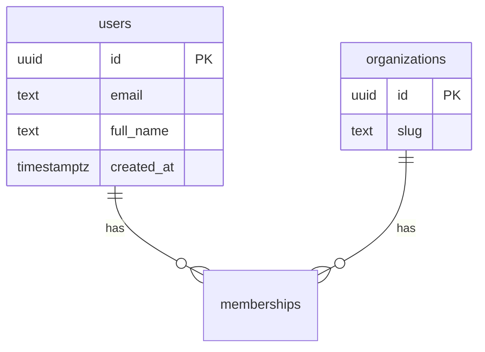
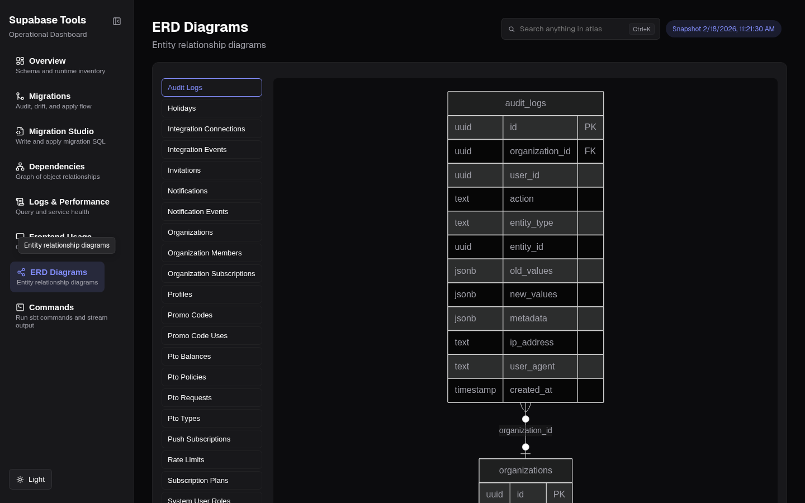

# @sbtools/plugin-erd

[](https://www.npmjs.com/package/@sbtools/plugin-erd)

Plugin that generates Mermaid ERD diagrams for each public table. Connects to the database to introspect columns, primary keys, and foreign keys.

## Quick Start

```bash
npm install @sbtools/plugin-erd
```

Add to config: `{ "path": "@sbtools/plugin-erd" }`

```bash
# Ensure database is running
npx sbt start
npx sbt generate-erd
# Output: docs/entity-relations/<table>.md
```

## Commands

| Command | Description |
|---------|-------------|
| `generate-erd` | Generate Mermaid ERD for all public tables |

Sample generated ERD (`docs/entity-relations/users.md`):

~~~

~~~

## Configuration

Plugin config goes in `plugins[].config`:

```json
{
  "plugins": [{
    "path": "@sbtools/plugin-erd",
    "config": {
      "erdOutput": "docs/development/entity-relations",
      "displayColumns": ["name", "email", "full_name", "slug", "title"]
    }
  }]
}
```

| Key | Default | Description |
|-----|---------|-------------|
| `erdOutput` | `<docsOutput>/entity-relations` | Output directory (derives from root `paths.docsOutput`) |
| `displayColumns` | `["name", "email", "full_name", "slug", "title"]` | Columns to display on referenced entities |

Global ERD display columns can also be set at the root level under `erd.displayColumns`.

## Dashboard Integration


*ERD page — Mermaid entity-relationship diagram with table list sidebar*

When active, the ERD plugin contributes to the dashboard automatically — no extra commands needed.

- **`getAtlasData()`** — reads the generated `.md` files from `erdOutput` at `sbt generate-atlas` time and adds an `erd_diagrams` category to `backend-atlas-data.json`
- **`getDashboardView()`** — declares the ERD section so the dashboard router shows it in the nav

The dashboard ERD page (`/erd`) renders each diagram as an interactive Mermaid SVG with table search and a raw source toggle. If `erd_diagrams` is missing from atlas data (e.g. `generate-erd` hasn't run yet), the dashboard falls back to reading `.md` files directly from the `erdOutput` directory at request time.

> **Note on `erdOutput`:** If you set a custom `erdOutput` path in plugin config, make sure it matches where `generate-erd` writes files. The dashboard resolves this path from `supabase-tools.config.json` at runtime — a mismatch causes the ERD page to appear empty.
