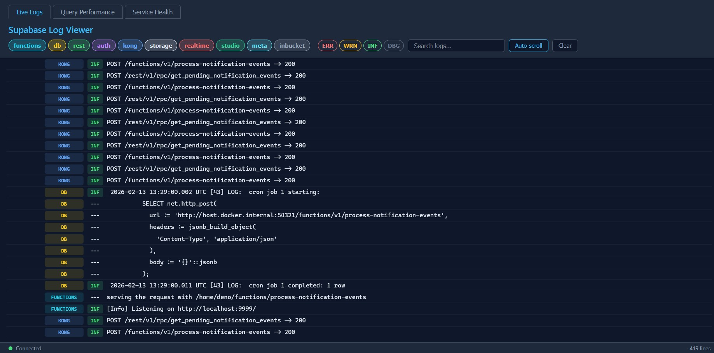

# @sbtools/plugin-logs

[](https://www.npmjs.com/package/@sbtools/plugin-logs)

Plugin that adds live Docker log tailing, `pg_stat_statements` query monitoring, and a standalone HTML log viewer.

## Dashboard Integration

- The unified `sbt dashboard` also exposes live logs directly in the Logs page.
- Live stream is served by dashboard APIs (`/api/logs/stream`, `/api/logs/services`) so you can monitor logs without leaving the dashboard shell.
- `logs viewer` remains available as a standalone, dedicated viewer.

## Quick Start

```bash
npm install @sbtools/plugin-logs
```

Add to config: `{ "path": "@sbtools/plugin-logs" }`

```bash
# Tail all services
npx sbt logs

# Open log viewer
npx sbt logs viewer
# → http://localhost:3333
```

## Commands

| Command | Description |
|---------|-------------|
| `logs` | Tail all services (multiplexed) |
| `logs <service>` | Tail single service |
| `logs --list` | List services |
| `logs pg-stats` | Top 20 queries by execution time |
| `logs pg-stats --slow` | By mean execution time |
| `logs pg-stats --frequent` | By call count |
| `logs viewer` | Start HTML log viewer |

```
$ npx sbt logs --list

Available services:
  ✓ functions    (running)
  ✓ db           (running)
  ✓ rest         (running)
  ✓ auth         (running)
  ✓ kong         (running)
  ✓ storage      (running)
  ✓ realtime     (running)
  ✓ studio       (running)
```


*Log viewer UI*

## Configuration

| Key | Default | Description |
|-----|---------|-------------|
| `viewerPort` | 3333 | Log viewer port |
| `tailLines` | 100 | Initial tail lines |
| `dbContainer` | supabase-db | DB container name |
