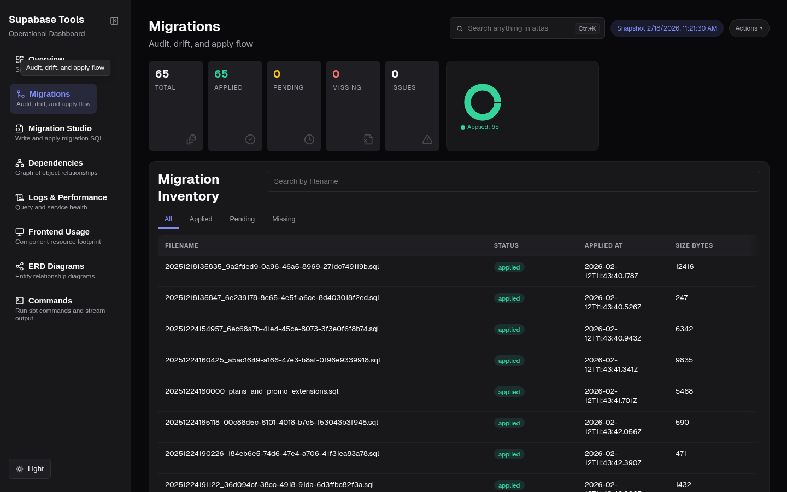

# @sbtools/plugin-migration-audit

[](https://www.npmjs.com/package/@sbtools/plugin-migration-audit)

Plugin that compares migration files on disk with `app_migrations.schema_migrations`. Detects drift, missing files, pending migrations. Reports via CLI, JSON, HTML, and Backend Atlas. **Read-only** — makes zero schema modifications.

## Quick Start

```bash
npm install @sbtools/plugin-migration-audit
```

Add to config: `{ "path": "@sbtools/plugin-migration-audit" }`

```bash
# Run audit (DB optional — disk-only if unreachable)
npx sbt migration-audit
# → docs/migration-audit.html
# → CLI summary + open in browser
```

```
$ npx sbt migration-audit

Migration Audit
━━━━━━━━━━━━━━━━━━━━━━━━━━━━━━━━━━━━━━━━━━━━━━━━━━━━━━━━━━━━━━━━━━━━━━━━━━━━━━
Migrations Dir  supabase/migrations
Database        Connected
Tracking Table  Exists

Total: 63  Applied: 63  Pending: 0  Missing: 0

Migrations:
  APPLIED  20251218135835_create_users.sql              (2026-02-12T11:43:40)
  APPLIED  20251218135847_add_organizations.sql         (2026-02-12T11:43:40)
  APPLIED  20251224154957_create_subscriptions.sql      (2026-02-12T11:43:40)
  ...

✓ HTML report → docs/migration-audit.html
✓ Detail pages → docs/migration-audit/<slug>.html
```

Each migration has a detail page with SQL viewer, parsed operations, risk flags, and touched objects. Links from the main report and Backend Atlas cards.

## Commands

| Command | Description |
|---------|-------------|
| `migration-audit` | CLI summary + HTML report + open browser |
| `migration-audit --json` | Output raw audit JSON |
| `migration-audit --html` | Generate HTML only |
| `migration-audit --no-open` | Skip opening browser |


*Migrations page — audit summary, inventory table with applied/pending/missing filters*

## Issues Detected

| Code | Severity | Description |
|------|----------|-------------|
| `MISSING_FILE` | error | Applied in DB but file missing on disk |
| `PENDING_MIGRATION` | warning | Files not yet applied |
| `NO_TRACKING_TABLE` | warning | `app_migrations.schema_migrations` missing |
| `ORDERING_GAP` | warning | Applied out of chronological order |
| `TIMESTAMP_PARSE_FAILURE` | info | Non-standard filename (no YYYYMMDDHHMMSS prefix) |
| `EMPTY_MIGRATION` | info | 0-byte migration files |

## Artifact

Produces `migration.analysis` v1.0.0. Includes per-migration `sqlAnalysis` (operations, touched objects, risk flags, confidence). Consumed by migration-studio for schema fallback and migrations context.

## Configuration

No config fields required. Uses `paths.migrations` and `paths.docsOutput`. Database optional — uses `DATABASE_URL` / `SUPABASE_DB_URL` / `POSTGRES_URL` when available.
